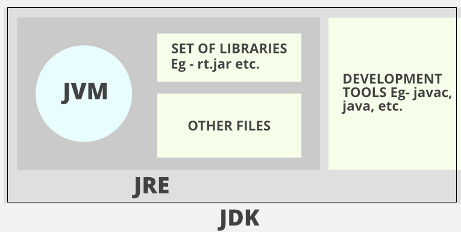
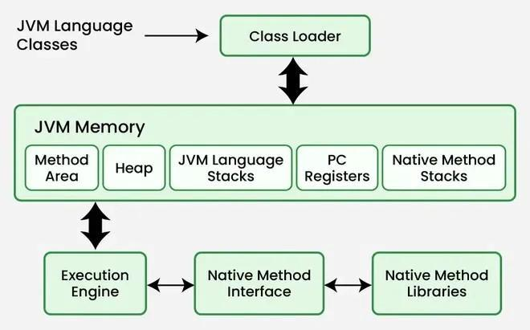
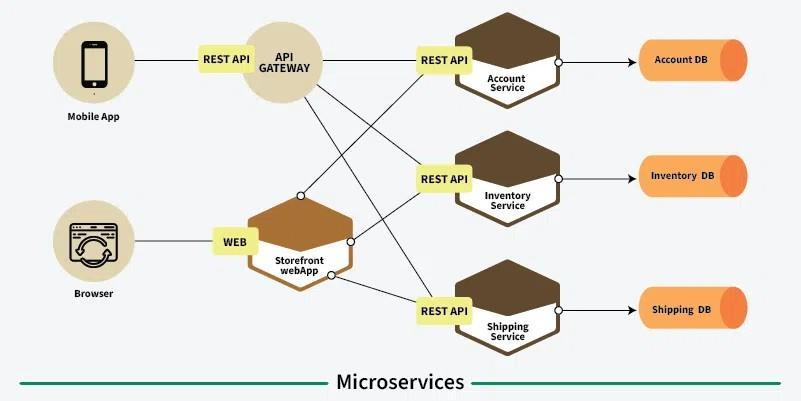

# Module 1: Introduction to Java and OOP Concepts

<!-- Source: M1 OOPS ktunotes.live-KTUNOTES.LIVE.pdf -->

<!-- page: 1 -->
<!-- page: 2 -->

## Topic: Introduction To Java

Structure of a simple java program; Java programming Environment and Runtime

## Topic: Environment (command Line & Ide); Java Compiler; Java Virtual Machine; Primitive

## Topic: Data Types And Wrapper Types; Casting And Autoboxing; Arrays; Strings; Vector Class;

## Topic: Operators Arithmetic, Bitwise, Relational, Boolean Logical, Assignment, Conditional

## Topic: (ternary); Operator Precedence; Control Statements Selection Statements, Iteration

## Topic: Statements And Jump Statements; Functions; Command Line Arguments; Variable

## Topic: Length Arguments; Classes; Abstract Classes; Interfaces. [use Proper Naming

## Topic: OOP Concepts

Data abstraction, encapsulation, inheritance, polymorphism, Procedural and object oriented programming paradigm; Microservices.

Module outline: Declaring Objects; Object Reference; Introduction To Methods; Constructors; Access Modifiers; This Keyword; Polymorphism; Method Overloading; Using Objects As Parameters; Returning Objects; Recursion; Static Members; Final Variables; Inner Classes; Inheritance; Super Class; Sub Class; Types of Inheritance; The super keyword; protected Members; Calling Order of Constructors; Method Overriding; Dynamic Method Dispatch; Using Final With Inheritance.

## Topic: Packages And Interfaces –

Packages - Defining a Package, CLASSPATH, Access Protection, Importing Packages.
Interfaces - Interfaces v/s Abstract classes, defining an interface, implementing interfaces, accessing implementations through interface references, extending interface(s).

## Topic: Exception Handling Checked Exceptions, Unchecked Exceptions, Try Block And Catch

## Topic: Clause, Multiple Catch Clauses, Nested Try Statements, Throw, Throws And Finally, Java

## Topic: Built In Exceptions, Custom Exceptions

Introduction to design patterns in Java : Singleton and Adaptor.
<!-- page: 3 -->

4 SOLID Principles in Java (https://www.javatpoint.com/solid-principles-java) Swings fundamentals – Overview of AWT, Swing v/s AWT, Swing Key Features, Model

## Topic: View Controller (mvc), Swing Controls, Components And Containers, Swing

## Topic: Packages, Event Handling In Swings, Swing Layout Managers, Exploring Swings–

## Topic: Jframe, Jlabel, The Swing Buttons, Jtextfield

## Topic: Event Handling – Event Handling Mechanisms, Delegation Event Model, Event

## Topic: Classes, Sources Of Events, Event Listener Interfaces, Using The Delegation Event

## Topic: Model

## Topic: Developing Database Applications Using JDBC – JDBC Overview, Types, Steps

Common JDBC Components, Connection Establishment, SQL Fundamentals [For projects only] - Creating and Executing basic SQL Queries, Working with Result Set,
<!-- page: 4 -->

## Topic: Introduction

## Topic: What Is Java?

## Topic: History Of Java

## Topic: Why Java?

## Topic: How Does Java Work?

## Topic: Installation Of Java

## Topic: What Is Java?

Java is a multiplatform, object -oriented programming language that runs on billions of devices worldwide. It powers applications, smartphone operating systems, enterprise software, and many well-known programs. Java is currently the most popular programming language for app developers.
Multiplatform: Java was branded with the slogan "write once, run anywhere" (or WORA). Java programming code written for one platform, like the Windows operating system, can be easily transferred to another platform, like a mobile phone OS, and vice versa, without being completely rewritten. Java works on multiple platforms because when a Java program gets compiled, the compiler creates a .class bytecode file that can run on any operating system that has the Java virtual machine (JVM) installed on it. It's typically easy to install a JVM on most major operating systems, including iOS.
Object-oriented: Java was among the first object -oriented programming languages. An object - oriented programming language organizes its code around classes and objects, rather than functions and commands. Most modern programming languages, including C++, C#, Python, and Rub y are object-oriented.

## Topic: History Of Java

Java was invented by James Gosling in 1995 at Sun Microsystems(which is now a part of Oracle
Corporation). This project started in 1991 and was initially called Oak. Later, it was renamed Java.
Java was designed with a syntax style similar to the C++ programming language . The first public version of Java, Java 1.0, was released in 1996. Today, Java powers everything from the Android mobile operating system to enterprise software.

## Topic: Why Java?

Java is an extremely transferable programming language used across platforms and different types of devices, from smartphones to smart TVs. Here are some specific, real-world examples of applications that are programmed with Java.
Mobile apps - Java is a preferred language of mobile app developers because of its stable platform and versatility. Popular mobile apps coded in Java include Spotify, Signal, and Cash App.
Web apps - A wide variety of web applications are developed using Java. Twitter and LinkedIn are among the most well-known.
Enterprise software - Enterprise software is software intended to serve a large group or organization. It includes software like billing systems and supply chain management programs.
Java's high scalability makes it an appealing language for developers writing enterprise software.
<!-- page: 5 -->

Games - Popular games written in the Java programming language include the original Minecraft and RuneScape.
IoT applications - Java is a popular choice for IoT developers because of how easily its code can be transferred between platforms.

## Topic: How Does Java Work?

Java is a multi-platform programming language. This means that it can be written for one OS and run on another. Java code is first written in a Java Development Kit , which is available for
Windows, Linux, and macOS. This kit translates the program into bytecode using a software called a compiler. Bytecode is then processed by an interpreter called a Java virtual machine (JVM) .
To run Java, JVMs load the code, verify it, and provide a runtime environment.

## Topic: Installation Of Java

Java, you first need to install the Java Development Kit (JDK) on your system. This article provides detailed steps for installing Java on Windows 7, 8, 10, 11, Linux Ubuntu, and macOS.

Here, we will discuss how to download and install Java on a Windows 64 -bit Machine and set up the environment to run the first Java program on the command prompt. The process is the same for all Windows, i.e. 7, 8, 10, and 11.
Step 1: Visit the official Oracle website https://www.oracle.com/in/java/. Click on the "Download
Java" icon as shown in the image below.
<!-- page: 6 -->

Step 2: Now you can see the latest version is JDK 23, and there are options for Linux, macOS, and
.exe file for 64-bit Windows OS.
Step 3: Go to Downloads and double-click on the downloaded jdk-23_windows- x64_bin.exe file.
So now the Java Installation Wizard opens, and then click Next button.
<!-- page: 7 -->

The installation will begin as shown below:
<!-- page: 8 -->

The Java installation is successfully completed as shown below. Now click on "close" to finish.
Step 4: Now we will set the environment variables for Windows OS . Open the C drive, go to
Program Files > Java > jdk -23 (or your installed version) > bin folder. Now, copy the path, and we will use this path when configuring the environment variables.
Search for the environment variable on your system, then click on the Environment Variables button.
<!-- page: 9 -->

In the system variable section, select the path variable and then click the option Edit.
Paste the path that you copied earlier, and click OK to save the changes.
Step 5: Verify the Installation. Open the command prompt and type the following command to verify the Java version that is installed in the system.
<!-- page: 10 -->

## Topic: Introduction To Java

## Topic: Java Programming Environment And Runtime Environment (command Line & Ide)

## Topic: Java Development Kit (jdk)

## Topic: Java Compiler

## Topic: Java Runtime Environment(jre)

## Topic: Java Virtual Machine(jvm)

## Topic: Arrays

## Topic: Strings

## Topic: Vector Class

## Topic: Operators – Arithmetic, Bitwise, Relational, Boolean Logical, Assignment

## Topic: Conditional(ternary)

## Topic: Operator Precedence

## Topic: Control Statement – Selection Statements, Iteration Statements, And Jump Statements

## Topic: Functions

## Topic: Classes

## Topic: Abstract Classes

## Topic: Interfaces

## Topic: Package Statement

## Topic: Import Statements

## Topic: Interface Section

## Topic: Class Definition

## Topic: Main Method

• It consists of comments in Java, which include basic information such as author’s name, date of creation, version, program name, company name, and description of the program.
• The compiler ignores these comments during execution.
• The commands may be o Single line Comment
• Example: // A single line comment is declared like this o Multi-line Comment
• Example: /* A multiline comment is declared like this and can have multiple lines as a comment*/
<!-- page: 11 -->

o Documentation Comment: These are a special type of multi -line comment used to generate API documentation automatically using the Javadoc tool.
• Example: /** A Documentation comment starts with a delimiter and ends with
*/

## Topic: Package Declaration

• The package declaration is optional.
• It is placed just after the documentation section
• This statement declares a package name and informs the compiler that the classes defined here belong to this package.
• Example: package student;
• This statement declares that all the classes and interfaces defined in this source file are a part of the student package. Only one package can be declared in the source file.

## Topic: Import Statements

• If we want to use any class of a particular package, we need to import that class.
• We use the import keyword to import the class.
• We use the import statements in two ways: o import a specific class
• Example: import java.util.Date; //import Date class in util package o import all classes of a particular package
• Example: import java.util.*; //import all classes in util package

## Topic: Interface Section

• This section is used to specify an interface in Java.
• It is an optional section that is mainly used to implement multiple inheritance in Java.
• It contains only constants and method declarations.
• An interface cannot be instantiated, but it can be implemented by classes or extended by other interfaces.
• Example: interface stack
{ void push(int item); void pop();

## Topic: Class Definition

• A Java program may contain several class definitions.
• A class is a collection of variables and methods that operate on the fields.
• Every Java program will have at least one class with a main method.
• Example: class Student //class definition
{

## Topic: Main Method Class

• It is essential for all Java programs. Because the execution of all Java programs starts from the main method.
<!-- page: 12 -->

• It must be inside a class.
• Inside the main method, we create objects and call the methods.

## Topic: Example: Public Class Example

{ public static void main(String arg[])
{

## Topic: System.out.println(“hello World”);

• public class Example o This creates a class called Example. Class names usually start with a capital letter. The public keyword means it is accessible from any other classes.
• Braces o The curly brackets are used to group all the commands.
• public static void main o When the main method is declared public, it can also be used outside of this class. o The word static allows to access this method without creating its objects. o The word void indicates that it does not return any value. o main is the method, which is an essential part of any Java program.
• String args[] o args[] an array of strings. We can pass command-line arguments to Java program. These arguments are stored in args[].
• System.out.println(); o The statement is used to print the output on the screen, where the System is a predefined class, and out is an object of the PrintWriter class. The method println prints the text on the screen with a new line. All Java statements end with a semicolon.
Multiline comment /* This is a simple Java program.
Call this file "Example.java".*/

## Topic: Similar To #include<stdio.h>

## Topic: Keyword Import Java.io.*;

## Topic: Identifier(class Name)

{
// Your program begins with a call to main().
Function to display a string public static void main(String args[])
{
System.out.println("This is a simple Java program.");
<!-- page: 13 -->

## Topic: Java Programming Environment And Runtime Environment (command Line & Ide)

1. Writing: Source code is written in .java files.
2. Compiling: The javac compiler converts source code into bytecode (.class files).
3. Execution: The Java command executes bytecode using the JVM.
<!-- page: 14 -->

## Topic: Key Components

• Text Editor or IDE: Used to write source code (.java files).
• Java Compiler (javac): Translates source code to bytecode
• Java Development Kit (JDK): A complete software development kit including tools like compiler, debugger, documentation generator, etc.
• Java API Libraries: Built-in classes and packages that offer ready-to-use functionality.

## Topic: Key Components

• JVM (Java Virtual Machine): Executes .class bytecode files. Platform -independent execution.

## Topic: Java Class Libraries

• Class Loader: Loads .class files into memory
• Execution Engine: Runs the bytecode, using JIT compilation for performance.

Code Writing Manual (Notepad, Vim) Advanced editor with IntelliSense.

## Topic: Eg: Eclipse, Netbeans

Debugging Manual (print statements) Visual debugger, step-by-step execution

## Topic: Java Development Kit (jdk)

The Java Development Kit (JDK) is a cross -platform software development environment that offers a collection of tools and libraries necessary for developing and executing Java-based software applications and applets. It includes:

## Topic: Java Runtime Environment (jre)

• an interpreter/loader (Java)
• a compiler (javac)
• an archiver (jar)
• a documentation generator (Javadoc), and
• other development tools.
<!-- page: 15 -->

## Topic: Java Compiler

• Java is a compiled language.
• Javac is the most popular Java compiler. It converts the Java program into bytecode.
• Java has a virtual machine called JVM, which then converts bytecode to the target code of the machine on which it is run.

## Topic: Java Runtime Environment (jre)

JRE provides an environment to run (not develop) Java programs in our machine. It consists of the Java Virtual Machine (JVM), core classes, and supporting files. Java source code is compiled and converted to Java bytecode. If you want to run this bytecode on any platform, you need JRE.
The JRE loads classes, checks memory access, and gets system resources. JRE acts as a software layer on top of the operating system.

## Topic: Java Virtual Machine

JVM is a part of JRE (Java Runtime Environment). Java applications are called WORA (Write
Once, Run Anywhere). This means a programmer can develop Java code on one system and expect it to run on any other Java -enabled system without any adjustments. This is all possible because of the JVM.
JVM (Java Virtual Machine) runs Java applications as a run -time engine. JVM is the one that calls the main method present in a Java code. When we compile a .java file, .class file is generated.
JVM. JVM is responsible for executing Java bytecode, managing memory, and ensuring platform independence.

## Topic: Architecture Of JVM
<!-- page: 16 -->

The classloader is a subsystem of JVM that is used to load all necessary classes and interfaces for the execution of a program. It is responsible for dynamically loading, linking, and initializing Java classes during runtime. a. Loading
• Reads .class files and loads them into the JVM memory.
• Stores the binary data in the method area.
• Records metadata such as: o Fully qualified class name and its parent class. o Type (class, interface, or enum). o Method and field information. b. Linking
• Verification: Ensures correctness of bytecode using Bytecode Verifier. If invalid, it throws java.lang.
• Preparation: Allocates memory for static variables and assigns default values.
• Resolution: Replaces symbolic references with direct references from the method area. c. Initialization
• Static variables are assigned explicit values.
• Static blocks are executed in the order of appearance.
• Follows top-to-bottom class loading and parent-to-child order in hierarchy.
There are three main types of class loaders in JVM:

## Topic: System/application Class Loader

## Topic: JVM Memory Areas

## Topic: Memory Area Description Shared?

Method Area Stores class-level data: class name, method info, static variables
Yes

## Topic: JVM Language

## Topic: Stack

Stores one runtime stack per thread; each method call has a stack frame
No
No

## Topic: Native Method

## Topic: Stack

Stores native (non-Java) method information No

## Topic: Execution Engine

## Topic: The Components Are
<!-- page: 17 -->

• Interpreter: o Executes bytecode line-by-line. o The problem with interpreter is that it interpret every time, even some methods are invoked multiple times, which affects the performance of the system. o To overcome this problem SUN people introduced JIT compilers.
• Just-In-Time (JIT) Compiler: o Converts bytecode to native machine code. o JIT compiler compiles the methods and generates corresponding native code. Next time JVM comes across that method call, then JVM directly uses native code and executes it instead of interpreting it once again, so that the performance of the system will be improved.
• Garbage Collector: o Reclaims memory by deleting objects with no references. o Improves memory efficiency automatically.

## Topic: Java Native Interface (jni)

• Acts as a bridge between Java and native applications written in languages like C or C++.
• Allows: o Java to call native functions. o Native code to call Java methods.
• Provides access to hardware-level operations and platform-specific features.

• Native method libraries are platform-specific code (like C or C++) that are linked with a
Java Virtual Machine (JVM) to extend Java functionality or access system resources not directly available through Java. These libraries are utilized through the Java Native
Interface (JNI), enabling Java code to call and be called by native code.
Why is JVM called an interpreter?
Whatever Java program you run using JRE or JDK goes into JVM, and JVM is responsible for executing the Java program line by line, hence it is also known as an interpreter.
Why is bytecode platform-independent?
Bytecode generated after compiling Java program on Mac, Windows, Linux, or Unix will be the same. Bytecode compiled on one platform can be executed on another platform. So the bytecode is platform-independent.
What gives Java its 'write once and run anywhere' nature?
The bytecode. Java is compiled to bytecode , which is the intermediate language between source code and machine code. This bytecode is not platform-specific and hence can be fed to any platform.
<!-- page: 18 -->

Data types are divided into two groups:
• Primitive data types – These are the fundamental building blocks and are predefined in
• Eg: byte, short, int, long, float, double, boolean, and char
• Non-primitive data types – They do not directly store the value but rather store references
(memory addresses) to objects. They are created using new keyword (except for String literals).

## Topic: Eg: String, Arrays, Classes, Objects, Interfaces Etc

The primitive data types in Java are classified as:

## Topic: Integer Type

## Topic: Floating Point Type

## Topic: Character Type

## Topic: Boolean Type
<!-- page: 19 -->

## Topic: Integer Type

• byte : o byte variables are declared by use of the byte keyword o Example: byte b, c; o Byte variables are useful when working with a stream of data from a network or file
• short o Short variables are declared by use of the short keyword o Example: short s; o Mostly applicable to 16-bit computers
• int : o Int variables are declared by use of the int keyword o Example: int s; o The most commonly used integer type is int
• long : o Long variables are declared by use of the long keyword o Example: long s;
All of these are signed, positive and negative values.
Type Size Minimum value Maximum value byte 1 byte -128 127 short 2 byte -32768 32767 int 4 byte -2147483648 2147483647 long 8 byte -9223372036854775808 9223372036854775807
It is advisable to use smaller data types whenever possible. For example, instead of storing a number like 50 in an int type variable, we must use a byte variable to handle this number. This will improve the speed of execution of the program.

## Topic: Floating Point Type

The floating point type can hold numbers containing fractional parts. Floating -point numbers are also known as real numbers. Java supports 2 kinds of floating-point storage:
• float: These are single -precision numbers. Single precision is faster on some processors and takes half as much space as double precision, but will become imprecise when the values are either very large or very small.

## Topic: Example: Float F;

• double: These are double-precision numbers. All math functions, such as sin( ), cos( ), and sqrt( ) , return double values. When we need to maintain accuracy over many iterative calculations or are manipulating large-valued numbers, double is the best choice.

## Topic: Example: Double D;

Float 4 byte 1.4e-045 3.4e+038 double 8 byte 4.9e-324 1.8e+308
<!-- page: 20 -->

Floating point data types support a special value known as Not-a-Number (NaN). NaN is used to represent the result of operations such a divided zero by zero, where an actual number is not present.

## Topic: Character Type

In Java, char is the data type used to store characters . Java uses Unicode to represent characters.
Unicode defines a fully international character set that can represent all of the characters found in all human languages. For this purpose, it requires 16 bits. The ASCII character set occupies the first 127 values in the Unicode character set. There are no negative chars.
Even though chars are not integers, in many cases, you can operate on them as if they were integers.
This allows you to add two characters together, or to increment the value of a character variable

## Topic: Boolean Type

Java has a simple type, called boolean, for logical values. It can have only one of two possible values, true or false. This is the type returned by all relational operators.

## Topic: Example: Public Class Primitivedatatypes

{ public static void main(String args[])
{ byte a = 25;
System.out.println("a: " + a); short b=100;
System.out.println("b: " + b); int c = 25000;
System.out.println("c: " + c); long d=1000000L;
System.out.println("d: " + d); float e = 2.2F;
System.out.println("e: " + e); double f=2.5;
System.out.println("f: " + f); boolean g = false;
System.out.println("g: " + g); char h = 'A'; char i=88;
System.out.println("h: " + h + " i: " + i); i++;
System.out.println("New value of i: " + i);

Char 2 byte 0 65536
<!-- page: 21 -->

Output: a: 25 b: 100 c: 25000 d: 1000000 e: 2.2 f: 2.5 g: false h: A i: X

## Topic: New Value Of I: Y

## Topic: Why Is Java Called A Strongly Typed Language?

• Every variable has a type, every expression has a type, and every type is strictly defined.
• All assignments, whether explicit or via parameter passing in method calls, are checked for type compatibility.
• The Java compiler checks all expressions and parameters to ensure that the types are compatible. Any type mismatches are errors that must be corrected before the compiler will finish compiling the class
• There are no automatic conversions of conflicting types.

## Topic: Wrapper Classes

Wrapper classes provide a way to use primitive data types (int, boolean, etc..) as objects. Wrapper classes help the Java program be completely object-oriented, whereas primitive data types help in the simple declaration of values with variables. They also help the code be serializable. The default value of the wrapper class is null as they are objects.

## Topic: Example: Public Class Wrapperclass

{ public static void main(String[] args)
{ Integer myInt = 567;
Double myDouble = 5.99;
Character myChar = 'A';
String myString = myInt.toString(); // convert integer to string

## Topic: System.out.println(myint);

## Topic: System.out.println(mydouble);

## Topic: System.out.println(mychar);
<!-- page: 22 -->

## Topic: System.out.println(mystring);

System.out.println(myString.length()); //length of the string

## Topic: Output: 567

5.99
A

There are certain needs for using the Wrapper class in Java as mentioned below:
• They convert primitive data types into objects. Objects are needed if we wish to modify the arguments passed into a method
• The classes in java.util package handles only objects, and hence wrapper classes help in this case.
• Data structures in the Collection framework, such as ArrayList and Vector, store only objects and not primitive types.
• An object is needed to support synchronization in multithreading.

## Topic: Casting

There are 2 types of casting. a) Widening Casting (Implicit) b) Narrowing Casting (Explicit) a) Widening Casting (Implicit)
• Converts a smaller type to a larger type size.
• Done automatically by the compiler.
<!-- page: 23 -->

## Topic: Example: Public Class Casting

{ public static void main(String[] args)
{ int myInt = 9; double myDouble = myInt; // Automatic casting: int to double

## Topic: Output: 9

9.0
From Type To Type byte short, int, long, float, double short int, long, float, double char int, long, float, double int long, float, double long float, double float double b) Narrowing Casting (Explicit)
• Converts a larger type to a smaller type.
• Must be done manually.

## Topic: Example: Public Class Nca

{ public static void main(String[] args)
{ double myDouble = 9.78d; int myInt = (int) myDouble; // Manual casting: double to int

## Topic: Output: 9.78

## Topic: Object Type Casting

Object casting involves converting one object reference to another within the inheritance hierarchy. a) Upcasting b) Downcasting a) Upcasting
• Casting a subclass object to a superclass type.
• Safe and done automatically.
<!-- page: 24 -->

## Topic: B) Downcasting

• Casting a superclass reference back to a subclass.
• Risky; must be done manually using a cast operator.
• May throw ClassCastException at runtime if invalid.

Java introduced autoboxing and unboxing in Java 5 to simplify conversions between primitive types and wrapper classes. a) Autoboxing
The automatic conversion of primitive types to the object of their corresponding wrapper classes is known as autoboxing. For example – conversion of int to Integer, long to Long, double to Double, etc.

## Topic: Example: Import Java.util.arraylist; Class Auto

{ public static void main(String[] args)
{ char ch = 'a';
Character a = ch; // Autoboxing- primitive to Character object

## Topic: Arraylist<integer> Arraylist = New Arraylist<integer>();

// Autoboxing because ArrayList stores only objects arrayList.add(25);
//printing the value from object

## Topic: System.out.println(arraylist.get(0));

## Topic: Output: 25
<!-- page: 25 -->

## Topic: B) Unboxing

It is just the reverse process of autoboxing. Automatically converting an object of a wrapper class to its corresponding primitive type is known as unboxing. For example, conversion of Integer to int, Long to long, Double to double, etc.

## Topic: Example: Import Java.util.arraylist; Class Unbox

{ public static void main(String[] args)
{ Character ch = 'a'; // unboxing - Character object to primitive char a = ch;
ArrayList<Integer> arrayList = new ArrayList<Integer>(); arrayList.add(24); int num = arrayList.get(0); // unboxing- get method returns an Integer object
System.out.println(num); // printing the values from primitive data types

## Topic: Output: 24

## Topic: Arrays

An array is a group of like-typed variables that are referred to by a common name. Arrays of any type can be created and may have one or more dimensions. A specific element in an array is accessed by its index. Arrays offer a convenient means of grouping related information.

## Topic: Declaring Array

Syntax 1: type var-name[];
Syntax 2: type[] var-name;

Syntax: var-name = new type[size];

Syntax 1: type var-name[] = new type[size];
Syntax 2: type[] var-name = new type[size];
Accessing an element of an Array:
Syntax: numbers[0] = 10; // Setting the first element of the array int firstElement = numbers[0]; // Accessing the first element
Syntax: numbers[0] = 20; // Changing the first element to 20

## Topic: Array Length

Syntax: int length = numbers.length;
<!-- page: 26 -->

## Topic: A) Single Dimensional Arrays

A Single-Dimensional Array is a linear array where elements are stored and accessed in a onedimensional (1D) index-based structure.

## Topic: Example: Public Class Arr

{ public static void main(String[] args)
{ int[] arr = {5, 10, 15}; for (int i = 0; i < arr.length; i++)
{ System.out.println("Element at index " + i + ": " + arr[i]);
Output: Element at index 0: 5
Element at index 1: 10
Element at index 2: 15 b) Multi-Dimensional Arrays:
A Multi-Dimensional Array is an array of arrays. The most commonly used is the two-dimensional
(2D) array, which can be visualized as a matrix or table of rows and columns.

## Topic: Example 1

## Topic: Class Multiarr

{ public static void main(String args[])
{ int twoD[][]= new int[4][5]; int i, j, k = 0; for(i=0; i<4; i++) for(j=0; j<5; j++)
{ twoD[i][j] = k; k++; for(i=0; i<4; i++) for(j=0; j<5; j++)
<!-- page: 27 -->

{ System.out.print(twoD[i][j] + "\t");

## Topic: System.out.println();

## Topic: Output

0 1 2 3 4
5 6 7 8 9
10 11 12 13 14
15 16 17 18 19
When you allocate memory for a multidimensional array, you need only specify the memory for the first (leftmost) dimension. You can allocate the remaining dimensions

## Topic: Example 2

// Manually allocate differing sizes in the second dimension. class MultiTwo
{ public static void main(String args[])
{ int twoD[][] = new int[4][]; twoD[0] = new int[1]; twoD[1] = new int[2]; twoD[2] = new int[3]; twoD[3] = new int[4]; int i, j, k = 0; for(i=0; i<4; i++) for(j=0; j<i+1; j++)
{ twoD[i][j] = k; k++; for(i=0; i<4; i++) for(j=0; j<i+1; j++)
{

## Topic: System.out.print(twod[i][j] + "\t");

## Topic: Output

1 2
3 4 5
6 7 8 9
The array created by this program looks like this:
<!-- page: 28 -->

## Topic: Strings

A String in Java is a sequence of characters used to store textual data. Java treats strings as objects, rather than primitive data types. The String class is defined in Java.lang package and is immutable, meaning once created, it cannot be changed.

## Topic: Using String Literals (string Constant Pool)

• Example: String s1 = "Hello";
• Java maintains a String Constant Pool (SCP) for string literals. When a string is created as a literal, the JVM checks the pool: o If it exists → returns the reference. o If not → creates a new object in SCP.

## Topic: Using New Keyword (heap Memory)

## Topic: Example: String S2 = New String("hello");

• Creates a new object in heap memory even if the same value exists in the SCP.
• Not memory efficient.

## Topic: String Immutability

Once a String object is created, its content cannot be changed.

## Topic: Example

String s = "Java" s.concat(" Programming"); // Does not change s

## Topic: System.out.println(s); // Output: Java

Method Description Example length() Returns the length of the string "Hello".length() → 5 charAt(int index) Returns the character at the given index "Java".charAt(1) → 'a' substring(int, int) Extracts substring "Hello".substring(1,4) → "ell" equals(String) Compares content "abc".equals("abc") → true equalsIgnoreCase() Case-insensitive comparison "ABC".equalsIgnoreCase("abc") compareTo(String) Lexicographic comparison "a".compareTo("b") → -1 toUpperCase() Converts to uppercase "java".toUpperCase() → "JAVA" toLowerCase() Converts to lowercase "JAVA".toLowerCase() → "java"
<!-- page: 29 -->

trim() Removes leading and trailing Whitespaces " Java ".trim() → "Java" replace(old, new) Replaces characters "abc".replace('a','z') → "zbc" split(String) Splits string by regex "a,b,c".split(",") → [a, b, c]

## Topic: String Comparison

## Topic: == Operator

• Compares reference (memory address).

## Topic: Equals() Method

• Compares actual content.

## Topic: Example

String a = "Java";
String b = "Java";
System.out.println(a == b); // true (SCP)

## Topic: System.out.println(a.equals(b)); //true

## Topic: String P = New String("java");

## Topic: String Q = New String("java");

System.out.println(p == q); // false

## Topic: System.out.println(p.equals(q)); //true

System.out.println(a == p); // false

## Topic: System.out.println(a.equals(p)); //true

## Topic: Mutable Alternatives: Stringbuilder And Stringbuffer

## Topic: Stringbuilder

• Mutable, non-synchronized (faster).

## Topic: Example

## Topic: Stringbuilder Sb = New Stringbuilder("hello"); Sb.append(" World");

## Topic: System.out.println(sb); // Output: Hello World

## Topic: Stringbuffer

• Mutable, thread-safe, synchronized (slower but safe for multi-threading).

## Topic: Example: Stringbuffer Sb = New Stringbuffer("hello"); Sb.append(" World");

## Topic: Comparison Table
<!-- page: 30 -->

## Topic: String Concatenation

## Topic: Using + Operator

String result = "Hello" + " " + "World";

## Topic: Using Concat() Method

## Topic: String Result = "hello".concat(" World");

## Topic: Example: Public Class St

{ public static void main(String args[])
{

## Topic: String Message1 = "hello, World!";

String message2 = new String("Java Programming"); char[] charArray = {'J', 'a', 'v', 'a', ' ', 'S', 't', 'r', 'i', 'n', 'g'};

## Topic: String Message3 = New String(chararray);

System.out.println("Message 1: " + message1);
System.out.println("Message 2: " + message2);
System.out.println("Message 3: " + message3); int length = message1.length(); //length of a string
System.out.println("Length of message1: " + length);

## Topic: // Concatenating Strings

String combinedMessage = message1 + " " + message2; // Using '+' operator
System.out.println("Combined message: " + combinedMessage);
String anotherCombined = message1.concat(" from " + message2);
System.out.println("Another combined message: " + anotherCombined);
// Checking for equality (case-sensitive and case-insensitive)
String strA = "apple";
String strB = "Apple";
System.out.println("strA equals strB (case-sensitive): " + strA.equals(strB));
System.out.println("strA equals strB (case-insensitive): " + strA.equalsIgnoreCase(strB));
// Extracting a substring
String sub = message2.substring(5, 16); // Extracts "Programming"
System.out.println("Substring of message2: " + sub); int javaIndex = message2.indexOf("Java");
System.out.println("Index of 'Java' in message2: " + javaIndex); // Output: 0

## Topic: // Replacing Characters

String replacedString = message1.replace('o', 'X');
System.out.println("String with 'o' replaced by 'X': " + replacedString);
<!-- page: 31 -->

## Topic: // Converting Case

String upperCase = strA.toUpperCase();
String lowerCase = strB.toLowerCase();
System.out.println("Uppercase strA: " + upperCase);
System.out.println("Lowercase strB: " + lowerCase);

## Topic: Output: Message 1: Hello, World!

## Topic: Message 2: Java Programming

## Topic: Message 3: Java String

Length of message1: 13
Another combined message: Hello, World! from Java Programming strA equals strB (case-sensitive): false strA equals strB (case-insensitive): true

## Topic: Substring Of Message2: Programming

Index of 'Java' in message2: 0
String with 'o' replaced by 'X': HellX, WXrld!

## Topic: Uppercase Stra: Apple

## Topic: Lowercase Strb: Apple

## Topic: Vector Class

In Java, the Vector class is a part of the Java Collection Framework. It is found in the package java.util and implements the List interface. Vector is synchronized, meaning it is thread -safe for operations in multi -threaded environments. It grows dynamically and allows the storage of duplicate elements and null values.

## Topic: Vector<type> Vectorname = New Vector<>();

Example: import java.util.Vector; public class Example
{ public static void main(String[] args)
{ Vector<String> names = new Vector<>(); names.add("Alice"); names.add("Bob");

## Topic: System.out.println(names);

## Topic: Output: [alice, Bob]

## Topic: Feature Description

## Topic: Package Java.util

## Topic: Implements List, Randomaccess, Cloneable, Serializable
<!-- page: 32 -->

## Topic: Null Elements Yes, Allows Null

## Topic: Maintains Order Yes, Insertion Order Is Preserved

Index-Based Access Yes, via get(index) and set(index, element)

Example import java.util.Vector; public class Ve
{ public static void main(String[] args)
{ Vector<String> fruits = new Vector<>(); fruits.add("Apple"); fruits.add("Banana");

Vector() Create an empty vector with default capacity(10)
Vector(int initialCapacity) Creates a vector with the specified capacity
Vector(int initialCapacity, int capacityIncrement)
Vector(int initialCapacity, int capacityIncrement)
Method Description add(E e) Adds an element at the end add(int index, E element) Inserts an element at the specified index addAll(Collection c) Adds all elements from the given collection get(int index) Returns the element at the given index set(int index, E element) Replaces the element at the specified index remove(Object o) Removes the first occurrence of the specified object remove(int index) Removes the element at the specified index size() Returns the number of elements clear() Removes all elements contains(Object o) Checks if the vector contains the specified element isEmpty() Checks if the vector is empty firstElement() / lastElement()
Returns the first/last element clone() Creates a shallow copy of the vector capacity() Returns the current capacity of the vector trimToSize() Trims capacity to current size
<!-- page: 33 -->

fruits.add("Cherry"); fruits.add(1, "Orange"); // Inserts element at specified index
System.out.println("Element at index 2: " + fruits.get(2)); // Accessing elements fruits.set(0, "Mango"); // Replace element at index fruits.remove("Banana"); // Remove by value fruits.remove(1); // Remove by index
// Check for presence

## Topic: System.out.println("contains Cherry? " + Fruits.contains("cherry"));

System.out.println("Is vector empty? " + fruits.isEmpty());
System.out.println("Size of vector: " + fruits.size());
System.out.println("Vector capacity: " + fruits.capacity());

## Topic: System.out.println("first Element: " + Fruits.firstelement());

## Topic: System.out.println("last Element: " + Fruits.lastelement());

Vector<String> fruitsCopy = (Vector<String>) fruits.clone();
System.out.println("Cloned Vector: " + fruitsCopy); fruits.clear();
System.out.println("After clear(), is empty? " + fruits.isEmpty());

## Topic: Output

## Topic: Element At Index 2: Banana

## Topic: Contains Cherry? True

Is vector empty? false
Size of vector: 2

## Topic: Vector Capacity: 10

## Topic: First Element: Mango

## Topic: Last Element: Cherry

## Topic: Cloned Vector: [mango, Cherry]

## Topic: After Clear(), Is Empty? True

## Topic: Operators – Arithmetic, Bitwise, Relational, Boolean Logical

## Topic: Assignment, Conditional(ternary) A) Arithmetic Operators

Arithmetic operators are used to perform mathematical calculations. The operands of the arithmetic operators must be of a numeric type. We cannot use them on Boolean types, but we can use them on char types, since the char type in Java is a subset of int.

## Topic: Type Operator Result

## Topic: Basic Arithmetic

## Topic: Operators

## Topic: + Addition

– Subtraction (also unary minus)

## Topic: * Multiplication

## Topic: / Division

## Topic: Modulus Operator % Modulus
<!-- page: 34 -->

## Topic: Example: Public Class Arithmeticoperators

{ public static void main(String[] args)
{ // arithmetic using integers
System.out.println("Integer Arithmetic"); int a = 1 + 1; int b = a * 3; int c = b / 4; int d = c - a; int e = -d;
System.out.println("a = " + a);
System.out.println("b = " + b);
System.out.println("c = " + c);
System.out.println("d = " + d);
System.out.println("e = " + e);
// arithmetic using doubles
System.out.println("\nFloating Point Arithmetic"); double da = 1 + 1; double db = da * 3; double dc = db / 4; double dd = dc - a; double de = -dd;
System.out.println("da = " + da);
System.out.println("db = " + db);
System.out.println("dc = " + dc);
System.out.println("dd = " + dd);
System.out.println("de = " + de);

## Topic: Output

Integer Arithmetic a = 2 b = 6 c = 1 d = -1 e = 1

## Topic: Increment &

## Topic: Decrement Operators

## Topic: – – Decrement

## Topic: Arithmetic

## Topic: Assignment Operators

## Topic: += Addition Assignment

## Topic: –= Subtraction Assignment

## Topic: *= Multiplication Assignment

## Topic: /= Division Assignment

## Topic: %= Modulus Assignment
<!-- page: 35 -->

Floating Point Arithmetic da = 2.0 db = 6.0 dc = 1.5 dd = -0.5 de = 0.5
When the division operator is applied to an integer type, there will be no fractional component attached to the result.

## Topic: Modulus Operator

The modulus operator, %, returns the remainder of a division operation. It can be applied to floating-point types as well as integer types.
Example: int x = 42; double y = 42.25;
System.out.println( x % 10); //output: 2
System.out.println( y % 10); //output: 2.25

• postfix form : the previous value is obtained for use in the expression, and then the operand is modified
Example: x = 42; y = x++; //The value of y is set to 42 and x is set to 43.
• prefix form : the operand is incremented or decremented before the value is obtained for use in the expression.
Example: x = 42; y = ++x; //The value of x is set to 43 and assign it to y b) Bitwise Operators:
Used to perform bit-level operations. Often used in low-level programming, flags, and embedded systems.

## Topic: ~ Bitwise Unary Not

## Topic: & Bitwise And

## Topic: | Bitwise Or

## Topic: ^ Bitwise Exclusive Or

## Topic: Right Shift Operator >> Shift Right

## Topic: Unsigned Right Shift Operator >>> Shift Right Zero Fill

## Topic: Left Shift Operator << Shift Left

## Topic: Bitwise Assignment Operators &= Bitwise And Assignment
<!-- page: 36 -->

## Topic: |= Bitwise Or Assignment

## Topic: ^= Bitwise Exclusive Or Assignment

>>= Shift right assignment
>>>= Shift right zero fill assignment
<<= Shift left assignment

## Topic: A B A|b A&b A^b ~a

0 0 0 0 0 1
1 0 1 0 1 0
0 1 1 0 1 1
1 1 1 1 0 0

## Topic: Example: Public Class Bitwiseoperators

{ public static void main(String[] args)
{ int a = 10; // 1010 int b = 4; // 0100 int andResult = a & b; int orResult = a | b; int xorResult = a ^ b; int complement = ~a; int leftShift = a << 2; int rightShift = a >> 1;
System.out.println("AND: " + andResult);
System.out.println("OR: " + orResult);
System.out.println("XOR: " + xorResult);
System.out.println("Complement: " + complement);

## Topic: System.out.println("left Shift: " + Leftshift);

## Topic: System.out.println("right Shift: " + Rightshift);

## Topic: Output And: 0

## Topic: Or: 14

## Topic: Xor: 14

## Topic: Complement: 1

## Topic: Left Shift: 40

## Topic: Right Shift: 5

## Topic: The Bitwise And

00101010 42
& 00001111 15
00001010 10
<!-- page: 37 -->

## Topic: The Bitwise Or

00101010 42
| 00001111 15
00101111 47

## Topic: The Bitwise Xor

00101010 42
^00001111 15
00100101 37

## Topic: Left Shift Operators

The left shift operator, <<, shifts all of the bits in a value to the left a specified number of times.
Syntax: value <<num num specifies the number of positions to left-shift the value in value.
For each shift left, the high -order bit is shifted out (and lost), and a zero is brought in on the right. byte and short values are promoted to int when an expression is evaluated. The result of such an expression is also int. In a negative byte or short value the high -order bits will be filled with 1’s.
Example: byte a = 64, b; int i = a << 2; b = (byte) (a << 2);

## Topic: System.out.println(a); //output: 64

## Topic: System.out.println(i); //output: 256

## Topic: System.out.println(b); //output: 0

## Topic: The Right Shift

The right shift operator, >>, shifts all of the bits in a value to the right a specified number of times. Each time we shift a value to the right, it divides that value by two and discards any remainder.
Syntax : value >>num num specifies the number of positions to right-shift the value in value.
Example : int a = 32; a = a >> 2; // a now contains 8
The >>operator automatically fills the high-order bit with its previous contents each time a shift occurs. This preserves the sign of the value.

## Topic: Example

–8>> 1 is –4
11111000 –8
>>1
11111100 –4
<!-- page: 38 -->

Unsigned shift -right operator, >>>, always shifts zeros into the high -order bit. Smaller values are automatically promoted to int in expressions.
Example: int a = -1; a = a >>> 24;
11111111 11111111 11111111 11111111 –1
>>>24
00000000 00000000 00000000 11111111 255 c) Boolean Logical Operators:
Example: boolean a = true; boolean b = false;
System.out.println(a && b); //false
System.out.println(a || b); //true

## Topic: System.out.println(!a); //false

## Topic: System.out.println(!b); // True

## Topic: Operator Result

## Topic: & Logical And

## Topic: | Logical Or

## Topic: ^ Logical Xor (exclusive Or)

## Topic: ! Logical Unary Not

## Topic: Short Circuit Operators || Short Circuit Or

## Topic: && Short Circuit And

## Topic: &= And Assignment

## Topic: |= Or Assignment

## Topic: ^= Xor Assignment

## Topic: Comparison Operators == Equal To

!= Not equal to

## Topic: Conditional(ternary) Operator ?: Ternary If Then Else

## Topic: A B A|b A&b A^b !a
<!-- page: 39 -->

From the preceding example, the OR operator results in true when a is true, no matter what b is. Similarly, the AND operator results in false when a is false, no matter what b is. If you use the || and && forms, Java will not bother to evaluate the right-hand operand when the outcome of the expression can be determined by the left operand alone.
Example: if (denom != 0 && num / denom> 10)
If this line of code were written using the single & version of AND, both sides would have to be evaluated, causing a run-time exception when denom is zero.
Example : situation in which && and || can not be used if(c==1 & e++ < 100) d = 100;
Here, using a single & ensures that the increment operation will be applied to e whether c is equal to 1 or not.

## Topic: Conditional(ternary) Operator

Syntax : expression1 ? expression2 : expression3
Here, expression1 can be any expression that evaluates to a boolean value. If expression1 is true, then expression2 is evaluated; otherwise, expression3 is evaluated. Both expression2 and expression3 are required to return the same type, which can’t be void.
Example: int i = -10; k = i< 0 ? -i : i; // k becomes 10 d) Relational Operators:

## Topic: Example: Public Class Relationaloperators

{ public static void main(String[] args)
{ int x = 25, y = 30;
System.out.println(x == y); //false
System.out.println(x != y); //true
System.out.println(x > y); //false
System.out.println(x < y); //true
System.out.println(x >= y); //false
System.out.println(x <= y); //true

## Topic: == Equal To

!= Not equal to

## Topic: > Greater Than

## Topic: < Less Than

>= Greater than or equal to
<= Less than or equal to
<!-- page: 40 -->

## Topic: Operator Precedence

Operator Precedence in Java determines the order in which operators are evaluated in an expression when there are multiple operators. Operators with higher precedence are evaluated before those with lower precedence. Associativity defines the direction (left -to-right or right-to-left) in which operators of the same precedence are evaluated.

15(highest)
()
[]
·

## Topic: Parentheses

## Topic: Array Subscript

## Topic: Member Selection

## Topic: Left To Right

14 ++
--

## Topic: Unary Post Increment

++
--
+
-
!
~
( type )

## Topic: Unary Pre Increment

## Topic: Unary Pre Decrement

## Topic: Unary Plus

## Topic: Unary Minus

## Topic: Unary Type Cast

## Topic: Right To Left

*
/
%

## Topic: Modulus

## Topic: Left To Right

11 +
-

## Topic: Addition

<<
>>
>>>

## Topic: Bitwise Left Shift

## Topic: Left To Right

<
<=
>
>= instanceof

## Topic: Relational Less Than

Type comparison (objects only)

## Topic: Left To Right

8 ==
!=

## Topic: & Bitwise And Left To Right

## Topic: ^ Bitwise Exclusive Or Left To Right

## Topic: | Bitwise Inclusive Or Left To Right

## Topic: && Logical And Left To Right

## Topic: || Logical Or Left To Right
<!-- page: 41 -->

2 ? : Ternary conditional Right to left
1(lowest)
=
+=
-=
*=
/=
%=

## Topic: Assignment

## Topic: Modulus Assignment

## Topic: Control Statement – Selection Statements, Iteration Statements And Jump Statements

Java control statements determine the flow of program execution based on conditions, loops, or abrupt changes. They are broadly categorized into:
1. Selection Statements: Allow branching based on conditions.
2. Iteration Statements: Execute a block of code repeatedly.
3. Jump Statements: Transfer control to another part of the program.

## Topic: Selection Statements

Statement Description if Executes a block of code if the condition is true. if-else Executes one block if the condition is true; otherwise, another block. if-else-if Executes one block from multiple conditions.
Examples 1: if Statement int age = 18; if (age >= 18)
{ System.out.println("Eligible to vote.");
Examples 2: if-else Statement int marks = 45; if (marks >= 50)

## Topic: { System.out.println("pass"); Else

## Topic: { System.out.println("fail");
<!-- page: 42 -->

Examples 3: if-else-if Ladder int marks = 85; if (marks >= 90)
{ System.out.println("Grade A"); else if (marks >= 75)

## Topic: { System.out.println("grade B"); Else

## Topic: { System.out.println("grade C");

Examples 4: switch Statement int day = 3; switch (day)
{ case 1: System.out.println("Monday"); break; case 2: System.out.println("Tuesday"); break; case 3: System.out.println("Wednesday"); break; default: System.out.println("Invalid day");
The expression inside switch must be of type byte, short, int, or char. The case values must be of a type compatible with the expression. Each case value must be a unique literal.

## Topic: Iteration Statements

Statement Description for Loop with initialization, condition, and increment/decrement. while Executes while a condition is true. do-while Executes once, then checks the condition.
Nested do-while do-while loop inside another do-while loop
Example 1: for Loop for (int i = 1; i <= 5; i++)
{ System.out.println("Iteration: " + i);
<!-- page: 43 -->

Example 2: while Loop int i = 1; while (i <= 5)
{ System.out.println("Iteration: " + i); i++;
Example 3: do-while Loop int i = 1; do
{ System.out.println("Iteration: " + i); i++;
} while (i <= 5);
Example 4: Enhanced for Loop int[] numbers = {10, 20, 30}; for (int num : numbers)
{ System.out.println("Number: " + num);

## Topic: Jump Statements

Statement Description break • It terminates a statement sequence in a switch statement
• It can be used to exit the loop that it currently resides.
• It can be used as a “civilized” form of goto.
Syntax: break label continue Skips the current iteration of a loop. return Exits from a method and optionally returns a value.
Example 1: break Statement for (int i = 1; i <= 5; i++)
{ if (i == 3) break;

## Topic: System.out.println(i);

## Topic: Output: 1

Example 2: “civilized” form of goto class Break
{ public static void main(String args[])
{ boolean t = true; first:
<!-- page: 44 -->

{ second:
{ third:
{
System.out.println("Before the break."); if(t) break second; // break out of second block

## Topic: System.out.println("this Won't Execute");

## Topic: System.out.println("this Won't Execute");

System.out.println("This is after second block.");

## Topic: Output: Before The Break

Example 3: continue Statement for (int i = 1; i <= 5; i++)
{ if (i % 2 == 0) continue;

## Topic: Output: 1

Example 4: continue may specify a label to describe which enclosing loop to continue. class ContinueLabel
{ public static void main(String args[])
{ outer: for (inti=0; i<5; i++)
{ for(int j=0; j<5; j++)
{ if(j >i)
{ System.out.println(); continue outer;
System.out.print(" " + (i * j));

## Topic: Output: 0

0 1
<!-- page: 45 -->

0 2 4
0 3 6 9
0 4 8 12 16

## Topic: Example 5: Return Statement Public Class Example

{ public static void main(String[] args)
{ System.out.println(getGreeting()); public static String getGreeting()
{ return "Hello, World!";

## Topic: Output: Hello, World!

## Topic: Functions

In Java, a function (commonly referred to as a method) is a block of code that performs a specific task and can be reused multiple times. Functions help in modularizing code, making it easier to read, maintain, and debug.
Syntax of a Function (Method) returnType functionName(parameter1, parameter2, ...)
{
// body of the function return value; // if returnType is not void

## Topic: Example 1

Example 2: int add(int a, int b)
{ int c=a+b; return c;
<!-- page: 46 -->

## Topic: Function Declaration, Definition And Call

• Declaration: Defined using the returnType, name, and parameters.
• Definition: Body of the method containing the logic.
• Calling: Executing the function from main() or another method.

## Topic: Example Program: All Function Types Public Class Functionexample

{ void greet() // No argument, no return
{
System.out.println("Hello, Welcome!"); void printSquare(int num) // With argument, no return
{
System.out.println("Square: " + (num * num)); int getFixedNumber() // No argument, with return
{ return 100; int add(int a, int b) // With arguments, with return
{ return a + b; public static void main(String[] args)
{ FunctionExample obj = new FunctionExample(); obj.greet(); // Calling greet() obj.printSquare(5); // Calling printSquare() int fixed = obj.getFixedNumber(); // Calling getFixedNumber()
System.out.println("Fixed Number: " + fixed); int sum = obj.add(10, 20); // Calling add()

No argument, no return value
Performs action, doesn’t return Anything void printMessage()
{………….
With arguments, no return value
Takes input, performs action void printName(String name)
{………….
No argument, with return value
Returns result without input int getCount()
{…………. }
Accepts input and returns result int sum(int a, int b)
{………….}
<!-- page: 47 -->

System.out.println("Sum: " + sum);

## Topic: Hello, Welcome! Square: 25

## Topic: Fixed Number: 100

## Topic: Sum: 30

Command Line Arguments in Java are the parameters passed to the main() method when a program is executed from the command line. They provide a way to input data to the program at runtime without using Scanner or GUI. Command-line arguments are stored as strings in the String array passed to main( ). To access these arguments, you can simply traverse the args parameter in the loop or use direct index value because args is an array of type String.
Syntax: public static void main(String[] args)

{ public static void main(String args[])
{ for(int i=0; i<args.length; i++)
System.out.println("args[" + i + "]: " + args[i]);

## Topic: Command Line Input: Java Commandlineexample Hello World

## Topic: Output: Args[0]: Hello Args[1]: World

Example: Add two numbers using command line arguments public class SumArguments
{ public static void main(String[] args)
{ int a = Integer.parseInt(args[0]); //Type Conversion (String → int) int b = Integer.parseInt(args[1]); int sum = a + b;
System.out.println("Sum: " + sum);
Command line input :: java SumArguments 20 40

## Topic: Output: Sum: 60

## Topic: Advantages

• Fast input method for testing and automation.
• No extra code needed for taking user input at runtime.
<!-- page: 48 -->

• Easy to parameterize Java programs.
• Helps in batch scripting and automation.

## Topic: Limitations

• All arguments are received as Strings, requiring type conversion.
• No input validation unless coded.
• Cannot be used interactively during runtime.

Variable Length Arguments (Varargs) allow a method to accept zero or more arguments of the same data type. This feature was introduced in Java 5 to support method calls with variable numbers of parameters without explicitly using arrays.
Syntax: returnType methodName(type... variableName)
• The ellipsis ... indicates varargs.
• Inside the method, the varargs parameter is treated as an array.
Example: Sum of any number of integers using varargs: public class VarargsExample
{ static int sum(int... numbers)
{ int total = 0; for (int num : numbers) total += num; return total; public static void main(String[] args)
{ System.out.println("Sum 1: " + sum(10, 20));
System.out.println("Sum 2: " + sum(5, 15, 25, 35));
System.out.println("Sum 3: " + sum()); // No arguments

## Topic: Sum 1: 30

## Topic: Sum 2: 80

## Topic: Sum 3: 0

## Topic: Rules Of Varargs

• Only one varargs parameter per method
• Varargs must be the last parameter
• Treated as an array inside method

{ static void display(String label, int... values)
<!-- page: 49 -->

{ System.out.print(label + ": "); for (int v : values)
System.out.print(v + " ");
System.out.println(); public static void main(String[] args)
{ display("Marks", 75, 80, 90); display("IDs", 101, 102); display("Empty");

## Topic: Output

Marks: 75 80 90

## Topic: Ids: 101 102

## Topic: Empty

## Topic: Advantages

• Code flexibility: Allows input of different argument counts.
• Reduces overloading: Minimizes the number of overloaded methods.
• Easy to use: Treated like an array inside the method.
• Improves readability: No need for array creation or overloads.

## Topic: Limitations

• One varargs per method only.
• Can be confusing when used with overloading and ambiguity.
• Slightly less efficient than fixed-length parameters due to array creation.

## Topic: Classes

A class in Java is a user-defined data type. It is a blueprint or prototype from which objects are created. The class forms the basis for object -oriented programming in Java. In object -oriented programming (OOP), a class is the fundamental building block that encapsulates data and methods. Any concept we wish to implement in a Java program must be encapsulated within a class.
Syntax of a Class: class classname
{ type instance-variable1; type instance-variable2;
// ... type instance-variableN; type methodname1(parameter-list)
{
// body of method type methodname2(parameter-list)
{
// body of method
<!-- page: 50 -->

// ... type methodnameN(parameter-list)
{
// body of method
• The methods and variables defined within a class are called members of the class.
• The variables, defined within a class are called instance variables because each instance of the class contains its own copy of these variables.
• The methods, defined within a class are called member functions. The code is contained within methods.
• The data for one object is separate and unique from the data for another.
Example: Define a class Box which defines three instance variables: width, height, and depth.
Also define a mehod called volume() to calculate the volume of the Box class Box
{ double Width; double Height; double Depth; void volume()
{ System.out.print("Volume is ");
System.out.println(width * height * depth);

## Topic: Object

An object is an instance of a class. It is the runtime instance of a class. To use a class, you need to create an object.
Class object declaration is a two-step process.
• Declare a variable of the class type
Syntax: classname class-var ;
• Acquire an actual, physical copy of the object and assign it to that variable
Syntax: class-var = new classname( );
The new operator allocates memory for an object during run time and returns a reference to it. This reference is the address in memory that the object allocated by new. This reference is then stored in the variable. class-var is a variable of the class type being created. classname is the name of the class that is being instantiated.

## Topic: Box Mybox = New Box();

Box mybox; // declare reference to object
<!-- page: 51 -->

mybox = new Box(); // allocate a Box object
To access these variables, we will use the dot (.) operator.
Syntax: obj.methodName(); obj.fieldName = value;
Example: assign the Width variable of mybox the value 100 mybox.Width = 100;

• Modularity: Code is organized into logical units.
• Reusability: Once written, classes can be reused in different programs.
• Encapsulation: Keeps data safe from outside interference.
• Inheritance: Enables code sharing across hierarchies.
• Abstraction: Hides complex implementation from the user.

## Topic: Difference: Class Vs Object

## Topic: Feature Class Object

## Topic: Blueprint Yes No

## Topic: Type Description

Abstract Class Cannot be instantiated; contains at least one abstract method

Anonymous Class Class without a name, defined in a single expression
<!-- page: 52 -->

2.19. Abstract Classes o A method without a definition is called an abstract method. o Abstract method indicates that this method must always be redefined in the subclass, thus making overridden compulsory. o This is done by using the keyword abstract. o Syntax: abstract type name(parameter-list); o Any class that contains one or more abstract methods is called abstract class. o Syntax: abstract class ClassName
{ abstract void method1(); // Abstract method (no body) void method2() // Concrete method (has body). Optional
{

## Topic: // Code O Example: Abstract Class Animal

{ abstract void makeSound(); // abstract method void eat() // concrete method
{ System.out.println("Animal eats food."); o Abstract classes must satisfy the following conditions:
▪ Can have abstract and non-abstract methods
▪ Can extend another class or be extended by others
▪ Subclass must override all abstract methods
▪ Abstract classes are not used to instantiate objects directly

## Topic: Ex: Animal S=new Animal();

It is illegal because Animal is an abstract class. Such an object would be useless, because an abstract class is not fully defined.
▪ We cannot declare abstract constructors or abstract static methods

{ System.out.println("Animal eats food."); class Dog extends Animal
{ void makeSound()

## Topic: { System.out.println("barks");
<!-- page: 53 -->

## Topic: Public Class Main

{ public static void main(String[] args)
{ Animal obj = new Dog(); // Polymorphic behavior obj.makeSound(); // Output: Barks obj.eat(); // Output: Animal eats food.

## Topic: Feature Abstract Class Concrete (regular) Class

Purpose Serve as a template/base class Fully functional class

• Promotes code reusability and extensibility
• Provides a common base for subclasses
• Enables partial implementation

• Can contain non-abstract methods for default behaviors

## Topic: Interfaces

{ return_type const1=value; //Constant declaration return_type const2=value; //Constant declaration return_type method1(); // Abstract method (implicitly public and abstract) return_type method2(); // Abstract method (implicitly public and abstract)
These constants are public, static, and final. Methods are public and abstract.

{ public void method1()
{ method1() definition public void method2()
{ method2() definition

• Methods are public and abstract by default . No need to specify explicitly.
• There is no variables, only constants. They are public, static, and final by default
<!-- page: 54 -->

• Classes use the implements keyword to inherit interfaces
• Supports multiple interface inheritance
• Can extend other interfaces. Eg: interface B extends A
• Cannot have constructors

## Topic: Example: Interface Vehicle

{ void start(); class Car implements Vehicle
{ public void start()
{ System.out.println("Car engine started"); public class Main
{ public static void main(String[] args)
{ Vehicle v = new Car(); // Polymorphism v.start(); // Output: Car engine started

## Topic: OOP Concepts

## Topic: Introduction: Data Abstraction, Encapsulation, Inheritance, Polymorphism

3.2. Procedural and object-oriented programming paradigm

## Topic: Microservices

## Topic: Introduction

• In function-oriented design, the system is comprised of many smaller sub -systems known as functions. These functions can perform significant tasks in the system.
• The system is considered as top view of all functions.
• Function-oriented design inherits some properties of structured design, where the divide and conquer methodology is used.
• This design mechanism divides the whole system into smaller functions, which provides a means of abstraction by concealing the information and its operation.
• These functional modules can share information among themselves by utilizing information passing and using information available globally.
• Another characteristic of functions is that when a program calls a function, the function changes the state of the program, which sometimes is not acceptable to other modules.
• Function-oriented design works well where the system state does not matter and programs/functions work on input rather than on a state.

• Object-oriented design works around the entities and their characteristics instead of the functions involved in the software system.
• The whole concept of the software solution revolves around the engaged entities.
<!-- page: 55 -->

## Topic: Class

A class is a user -defined data type. It consists of data members and member functions, which can be accessed and used by creating an instance of that class. It represents the set of properties or methods that are common to all objects of one type. A class is like a blueprint for an object.
Example: Consider the Class of Cars. There may be many cars with different names and brands, but all of them will share some common properties , like all of them will have 4 wheels, Speed Limit, Mileage range, etc. So here, the Car is the class, and wheels, speed limits, and mileage are its properties.

## Topic: Object

It is a basic unit of Object -Oriented Programming and represents real-life entities. An
Object is an instance of a Class. When a class is defined, no memory is allocated, but when it is instantiated (i.e. an object is created) memory is allocated. An object has an identity, state, and behavior. Each object contains data and code to manipulate the data. Objects can interact without having to know details of each other’s data or code. It is sufficient to know the type of message accepted and type of response returned by the objects.
Example: “Dog” is a real -life Object, which has some characteristics like color, Breed,

## Topic: Bark, Sleep, And Eats
<!-- page: 56 -->

## Topic: Data Abstraction

Consider a real-life example of a man driving a car. The man only knows that pressing the accelerator will increase the speed of the car or applying brakes will stop the car, but he does not know about the inner mechanism of the car or the implementation of the accelerator, brakes, etc in the car. This is what abstraction is.

## Topic: Encapsulation

Storing data and functions in a single unit (class) is encapsulation(information hiding).
This is complementary to abstraction and is used to desc ribe the process of defining the code and data, which form an object. Encapsulation conceals the functional details of the class from the objects that send messages to it.
Encapsulation is defined as the wrapping up of data under a single unit. It is the mechanism that binds together code and the data it manipulates. In Encapsulation, the variables or data of a class are hidden from any other class and can be accessed only t hrough any member function of their class in which they are declared. As in encapsulation, the data in a class is hidden from other classes, so it is also known as data-hiding.
Consider a real -life example of encapsulation . in a company, there are different sections like the accounts section, finance section, sales section, etc. The finance section handles all the financial transactions and keeps records of all the data related to finance. Similarly, the sales section handles all the sales-related activities and keeps records of all the sales. Now, there may arise a situation when, for some reason, an official from the finance section needs all the data about sales in a particular month. In this case, he is not allowed to directly access the data of the sales section. He will first have to contact some other officer in the sales section and then request him to give the particular data. This is what encapsulation is.
<!-- page: 57 -->

Here, the data of the sales section and the employees who can manipulate them are wrapped under a single name, “sales section”.

## Topic: Inheritance

Inheritance is an important pillar of OOP(Object-Oriented Programming). The capability of a class to derive properties and characteristics from another class is called Inheritance. When we create a class, we do not need to write all the properties and functions again and again, as these can be inherited from another class that possesses it. Inheritance allows the user to reuse the code whenever possible and reduce its redundancy.

## Topic: Polymorphism
<!-- page: 58 -->

For example, A person at the same time can have different characteristics. A man can be a father, a husband, and an employee at the same time. So the same person possesses different behavior in different situations. This is called polymorphism.
3.2. Procedural and object-oriented programming paradigm

Procedural Programming is a programming paradigm based on the concept of procedures or routines (also called functions). The program is structured as a sequence of instructions or function calls that operate on data.

## Topic: Characteristics

• Focuses on functions and procedures.
• Data and functions are separate.
• Code is executed line-by-line in a top-down approach.
• Uses global variables for data sharing.

Object-Oriented Programming (OOP) is a programming paradigm that is based on the concept of
"objects", which contain both data and methods. The code is organized into classes and objects.

## Topic: Characteristics

• Focuses on objects and classes.
• Combines data and methods into a single unit (class).
• Encourages modular, reusable, and scalable code.

## Topic: Supports Four Main Principles: Encapsulation, Abstraction, Inheritance, And

## Topic: (oop)

## Topic: Basic Unit Procedure Or Function Object (instance Of Class)

Focus Actions (what to do) Data and behavior (what it is and does)
Code Reusability Limited (via function calls) High (via inheritance and polymorphism)
Security Low (global data can be altered)
High (encapsulation protects data)

## Topic: Languages

## Topic: C, Pascal, Fortran Java, C++, Python, C#
<!-- page: 59 -->

## Topic: Microservices

A microservice is a small, loosely coupled service that is designed to perform a specific business function, and each microservice can be developed, deployed, and scaled independently.
• This architecture allow you to take a large monolith application and decompose it into small manageable components/services. Also, it is considered as the building block of modern applications.
• Microservices can be written in a variety of programming languages, and frameworks, and each service acts as a mini-application on its own.

## Topic: Feature Description

Modularity Application is broken into smaller services/modules
Decentralized Data Each microservice may have its own database (no shared DB)

## Topic: Technology

## Topic: Agnostic

Different services can use different programming languages/technologies

## Topic: Lightweight

## Topic: Communication

Typically uses REST APIs or messaging queues for inter-service communication

1. Scalability: Services can scale individually based on demand.
2. Faster Development: Teams can work independently on services.
3. Technology Diversity: Different tech stacks can be used for different services.
4. Resilience: One service failure doesn’t crash the entire system.
5. Continuous Deployment: Easier to update one service without redeploying the whole app.
6. Improved Fault Isolation: Bugs in one microservice affect only that service.
<!-- page: 60 -->

## Topic: Declaring Objects

## Topic: Object Reference

## Topic: Constructors

## Topic: Access Modifiers

## Topic: This Keyword

## Topic: Syntax: Classname Objname = New Classname();

## Topic: Example: Class Car

{ void display()
{ System.out.println("This is a car."); public class Main
{ public static void main(String[] args)
{ Car myCar = new Car(); // Object declaration myCar.display(); // Method call using object

## Topic: Example

Car car1 = new Car(); // 'car1' is an object reference
Car car2 = car1; // Both car1 and car2 refer to the same object car1.display(); // Output: This is a car. car2.display(); // Output: This is a car.

A method is a block of code that performs a specific task. It is invoked using an object or directly if it's static.

## Topic: Syntax: Returntype Methodname(parameters)

{
// method body
<!-- page: 61 -->

## Topic: Example: Class Calculator

{ int add(int a, int b)
{ return a + b; public class Main
{ public static void main(String[] args)
{ Calculator calc = new Calculator(); int sum = calc.add(5, 3);
System.out.println("Sum: " + sum);
Example: Create a class Box that initialize the dimensions of a box width, height, depth. The class should have a method that print the volume of the box. Create an object of the Box class and test the functionalities class Box
{ double width; double height; double depth; void volume()
{ System.out.print("Volume is ");
System.out.println(width * height * depth); class BoxDemo
{ public static void main(String args[])
{ Box b1 = new Box();

## Topic: Box B2 = New Box();

// assign values to mybox1's instance variables b1.width = 10; b1.height = 20; b1.depth = 15;
// assign different values to mybox2's instance variables b2.width = 3; b2.height = 6; b2.depth = 9; b1.volume(); // display volume of first box b2.volume(); // display volume of second box

## Topic: Output : Volume Is 3000.0

## Topic: Volume Is 162.0
<!-- page: 62 -->

Example: Create a class Box that initialize the dimensions of a box width, height, depth. The class should have a method that returns the volume of the box. Create an object of the Box class and test the functionalities class Box
{ double width; double height; double depth; double volume()
{ return width * height * depth; class BoxDemo4
{ public static void main(String args[])
{ Box b1 = new Box();
Box b2 = new Box(); double vol;
// assign different values to mybox2's instance variables b2.width = 3; b2.height = 6; b2.depth = 9; vol = b1.volume(); // get volume of first box
System.out.println("Volume is " + vol); vol = b2.volume(); // get volume of second box
System.out.println("Volume is " + vol);

## Topic: Volume Is 162.0

Example: uses of a parameterized method class Box
{ double width; double height; double depth; double volume() // compute and return volume
{ return width * height * depth; void setDim(double w, double h, double d) // sets dimensions of box
{ width = w; height = h; depth = d;
<!-- page: 63 -->

## Topic: Class Boxdemo

{ public static void main(String args[])
{ Box b1 = new Box();
Box b2 = new Box(); b1.setDim(10, 20, 15); // initialize first box b2.setDim(3, 6, 9); // initialize second box double vol = b1.volume(); // get volume of first box
System.out.println("Volume is " + vol);

## Topic: Volume Is 162.0

## Topic: Constructor Definition

It has the same name as the class and no return type, not even void.
Syntax: Class Classname
{ Classname()
{ // constructor body

## Topic: Default Constructor

• Provided by the compiler if no constructor is defined.
• Initializes objects with default values.

Example: Class Car

{ Car() // default constructor

{ System.out.println("default Constructor Called"); Public Class Main

{ public static void main(String[] args)
{ Car c1 = new Car(); // calls default constructor

Output: Default Constructor Called
<!-- page: 64 -->

## Topic: Parameterized Constructor

• Accepts arguments to initialize object values.

Example: Class Student

{ String name; int age;
Student(String n, int a) //Parameterized Constructor
{ name = n; age = a; void display()
{ System.out.println(name + " is " + age + " years old."); public class Main
{ public static void main(String[] args)
{ Student s = new Student("Alice", 20); s.display();
Output: Alice is 20 years old.

## Topic: Copy Constructor

• Copies data from one object to another.

Example: Class Book

{ String Title;

Book(string T)

{ title = t;
Book(Book b) // copy constructor
{ title = b.title; void show()
{ System.out.println("Title: " + title); public class Main
{ public static void main(String[] args)

{ Book B1 = New Book("java Programming");

Book b2 = new Book(b1); // copy object b2.show();

Output: Title: Java Programming
<!-- page: 65 -->

## Topic: Access Modifiers

Access modifiers in Java are keywords used to set the visibility or accessibility of classes, methods, constructors, and variables. They control how the members of a class can be accessed from other classes or packages.

## Topic: Types Of Access Modifiers In Java: A. Private

• These are accessible only within the same class. b. default (no modifier)
• When no modifier is specified, it is known as package-private or default access.
• Members are accessible to any class in the same package. c. protected
• The protected access modifier allows access: o Within the same package o In subclasses even if they are in different packages d. public
• The public modifier allows the member to be accessible from anywhere — from any class and package
• This method can be accessed from any other class in any package

## Topic: Outside The Package(subclass)

(Only to derived classes) No default Yes Yes No No private Yes No No No

## Topic: Example Class Test

{ int a; // default access public int b; // public access private int c; // private access void setc(int i) // methods to access c
{ c = i; int getc()
{ return c;
<!-- page: 66 -->

## Topic: Class Accesstest

{ public static void main(String args[])
{ Test ob = new Test(); ob.a = 10; ob.b = 20;
// ob.c = 100; // Error! ob.setc(100); // You must access c through its methods
System.out.println("a, b, and c: " + ob.a + " " + ob.b + " " + ob.getc());

## Topic: This Keyword

In Java, "this" is a reference variable that refers to the current object instance. It is mainly used to,
• Call current class methods and fields
• To pass an instance of the current class as a parameter
• To differentiate between the local and instance variables.
Using "this" reference can improve code readability and reduce naming conflicts.
Different way to use "this" in Java
Following are the ways to use the "this" keyword in Java:
1. Using "this" keyword to refer to current class instance variables.
2. Using this() to invoke the current class constructor
3. Using 'this' keyword to return the current class instance
4. Using 'this' keyword as the method parameter
5. Using 'this' keyword to invoke the current class method
6. Using 'this' keyword as an argument in the constructor call

## Topic: Using "this" To Refer To Current Class Instance Variables Class This

{ int a, b;
This(int a, int b) // Parameterized constructor
{ this.a = a; this.b = b; void display()
{ System.out.println("a = " + a + " b = " + b); public static void main(String[] args)
{ This object = new This(10, 20); object.display();
Output: a = 10 b = 20
<!-- page: 67 -->

## Topic: Constructor Chaining with this()

{ int a; int b;

{ this(10, 20);
System.out.println("Inside default constructor \n");
This(int a, int b) // Parameterized constructor
{ this.a = a; this.b = b;
System.out.println("Inside parameterized constructor"); public static void main(String[] args)
{ This object = new This();

Output: Inside Parameterized Constructor

## Topic: Returning Current Object with this

{ int a, b;

{ a = 10; b = 20;
This get() // Method that returns current class instance
{ return this; void display()
{
This object = new This(); object.get().display();
Output: a = 10 b = 20

## Topic: Passing this as Method Parameter

{ int a; int b;
<!-- page: 68 -->

{ a = 10; b = 20; void display(This obj) // Method that receives "this" keyword as parameter
{ System.out.println("a = " + obj.a+ " b = " + obj.b); void get() // Method that returns current class instance
{ display(this); public static void main(String[] args)
{ This object = new This(); object.get();
Output: a = 10 b = 20

## Topic: Using "this" Keyword To Invoke The Current Class Method Class This

{ void display()
{ this.show(); // calling function show()
System.out.println("Inside display function"); void show()
{ System.out.println("Inside show function"); public static void main(String args[])
{ This g1 = new This(); g1.display();

## Topic: Output: Inside Show Function

6. Using "this" Keyword as an Argument in the Constructor Call class A
{

## Topic: B Obj;

A(B obj) // Parameterized constructor with object of B as a parameter
{ this.obj = obj; obj.display();
<!-- page: 69 -->

## Topic: Class B

{ int x = 5;
// Default Constructor that create an object of A with passing this as an argument
//in the constructor
B()
{ A obj = new A(this); void display()
{ System.out.println("Value of x in Class B : " + x); public static void main(String[] args)
{ B obj = new B();

## Topic: Output: Value Of X In Class B : 5

## Topic: Advantages Of Using "this" Reference

• It helps to distinguish between instance variables and local variables with the same name.
• It can be used to pass the current object as an argument to another method.
• It can be used to return the current object from a method.
• It can be used to invoke a constructor from another overloaded constructor in the same class.

## Topic: Disadvantages Of Using "this" Reference

• Overuse of this can make the code harder to read and understand.
• Using this unnecessarily can add unnecessary overhead to the program.
• Using this in a static context results in a compile-time error.
• Overall, this keyword is a useful tool for working with objects in Java, but it should be used judiciously and only when necessary
<!-- page: 70 -->

## Topic: Educational Figures

**Figure:** JDK and JRE component relationship.  
**Source:** M1 OOPS ktunotes.live-KTUNOTES.LIVE.pdf, page 15.

**Figure:** JVM architecture and memory areas.  
**Source:** M1 OOPS ktunotes.live-KTUNOTES.LIVE.pdf, page 15.

**Figure:** Microservices interaction overview.  
**Source:** M1 OOPS ktunotes.live-KTUNOTES.LIVE.pdf, page 59.
